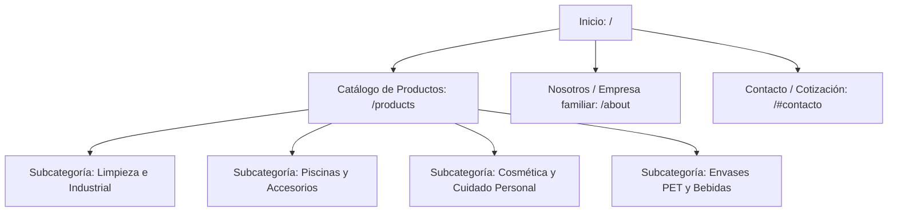

# Análisis de Palabras Clave y Estrategia SEO - Plásticos Santa María

Este documento recopila de manera exhaustiva y profesional la estrategia de posicionamiento orgánico (SEO), análisis de palabras clave (Keywords), estructuración de la información y marcado de datos estructurados para **Plásticos Santa María**.

Está diseñado con dos objetivos principales:
1. **Para Marketing / Especialistas SEO:** Servir como guía estratégica de términos clave, intenciones de búsqueda (search intent) y combinaciones semánticas para posicionar a la empresa en Google en el sector de fabricación y distribución de envases y accesorios plásticos por mayor en Argentina.
2. **Para Desarrollo Web:** Detallar los esquemas de metadatos, estructuración semántica de HTML5, optimización de velocidad de carga y datos estructurados (Schema.org) para garantizar una indexación óptima y la generación de resultados enriquecidos (*Rich Snippets*) en los buscadores.

---

## ÍNDICE DE SECCIONES
1. [Posicionamiento de Marca e Intención de Búsqueda (B2B)](#1-posicionamiento-de-marca-e-intención-de-búsqueda-b2b)
2. [Estructura del Sitio y Optimización On-Page](#2-estructura-del-sitio-y-optimización-on-page)
3. [Estrategia de Palabras Clave (Keywords SEO)](#3-estrategia-de-palabras-clave-keywords-seo)
4. [Análisis Semántico y Fichas Técnicas de Productos](#4-análisis-semántico-y-fichas-técnicas-de-productos)
5. [Marcado de Datos Estructurados (Schema.org JSON-LD)](#5-marcado-de-datos-estructurados-schemaorg-json-ld)
6. [Plan de Acción para SEO Técnico e Imágenes](#6-plan-de-acción-para-seo-técnico-e-imágenes)
7. [Consultas Estratégicas para la Empresa](#7-consultas-estratégicas-para-la-empresa)

---

## 1. POSICIONAMIENTO DE MARCA E INTENCIÓN DE BÚSQUEDA (B2B)

**Plásticos Santa María** se posiciona como una empresa familiar fabricante y distribuidora mayorista de envases plásticos soplados e inyectados (PEAD, PVC, PET, PP) y accesorios de mantenimiento para piscinas. 

### Perfil de Cliente Ideal (Target Personas):
*   **Fábricas de Productos de Limpieza:** Químicas y PyMEs locales que fabrican jabón líquido, lavandina, desengrasantes, ceras y suavizantes, que necesitan envases resistentes y ligeros (de 1 lt, 2 lts, 4 lts y bidones de 5 y 10 lts) con pesos consistentes para evitar derrames o roturas.
*   **Distribuidores y Químicas Mayoristas:** Comercios que revenden insumos químicos al por mayor y menor, que buscan un proveedor confiable y directo de fábrica con stock permanente.
*   **Comercios del Rubro de Piscinas y Jardín:** Locales de mantenimiento de piletas y viveros que necesitan boyas satélite, limpiafondos, sacahojas y envases para cloro y alguicidas.
*   **Industrias Cosméticas y de Higiene Personal:** Empresas que requieren envases estéticos (como jaboneras cilíndricas u ovales de PVC, y envases para repelentes).

### Enfoque de Búsqueda (B2B Search Intent):
Las consultas dirigidas a esta web no buscan una unidad individual, sino volumen, precios directos de fábrica, confiabilidad en la logística, calidad en los pesos y resistencia química de los plásticos (especialmente PEAD para ácidos o cloro). Por tanto, la redacción de la web y el SEO debe estar enfocada a **"Por mayor"**, **"Distribuidor"**, **"Fábrica directa"** y **"Venta mayorista"**.

---

## 2. ESTRUCTURA DEL SITIO Y OPTIMIZACIÓN ON-PAGE

Para maximizar el rastreo de Googlebot, se propone una estructura de URLs y jerarquía de encabezados (`H1`, `H2`, `H3`) clara y semántica:



### Arquitectura de Encabezados Recomendada:
*   **`<h1>` (Único por página):**
    *   *Página de Inicio:* `Plásticos Santa María | Fábrica de Envases Plásticos por Mayor`
    *   *Página de Productos:* `Catálogo de Envases Plásticos Directo de Fábrica`
    *   *Página de Nosotros:* `Sobre Plásticos Santa María | Trayectoria Familiar`
*   **`<h2>` (Secciones Principales):**
    *   `Nuestras Categorías de Envases`
    *   `Ofertas y Productos Destacados`
    *   `¿Por qué elegir a Plásticos Santa María?`
    *   `Solicitar Cotización Mayorista`
*   **`<h3>` (Fichas de Productos / Subsecciones):**
    *   *Utilizar nombres exactos combinados con características:* `Bidón Virgen de PEAD x 5 Litros`, `Envase Suavizante de PEAD x 4 Litros`, `Boya Satélite Grande para Piscinas`.

---

## 3. ESTRATEGIA DE PALABRAS CLAVE (KEYWORDS SEO)

El universo de keywords para Plásticos Santa María se organiza según la intención de búsqueda y el tipo de producto:

### Grupo A: Transaccionales / Intención Comercial de Volumen (B2B)
*   *fabrica de envases plasticos buenos aires*
*   *envases plasticos por mayor argentina*
*   *distribuidora de envases de plastico*
*   *comprar bidones de 5 litros por mayor*
*   *proveedor de envases para productos de limpieza*
*   *envases plasticos soplados precio*
*   *venta mayorista de envases pet*
*   *fabrica de boyas y accesorios para piscinas*

### Grupo B: Específicas por Material y Tecnología (SEO Técnico)
*   *envases de PEAD (Polietileno de Alta Densidad) por mayor*
*   *botellas de PVC cristal para gatillo*
*   *envases PET de 1 litro transparentes*
*   *envase plastico resistente para destapacañerias*
*   *bidon de plastico recuperado caramelo*
*   *potes de PEAD de 1kg y 5kg*

### Grupo C: Búsquedas Geográficas (SEO Local)
*   *fabrica de envases de plastico zona oeste / zona sur / buenos aires*
*   *envases plasticos mayorista caba*
*   *despachos de bidones plasticos al interior del pais*

---

## 4. ANÁLISIS SEMÁNTICO Y FICHAS TÉCNICAS DE PRODUCTOS

Clasificamos el catálogo real de la empresa (extraído de `products.ts`) y le asociamos sus palabras clave óptimas para SEO:

### Categoría 1: Limpieza, Piscinas e Industrial (Envases de Mayor Capacidad)
Envases diseñados con Polietileno de Alta Densidad (PEAD) que ofrecen alta resistencia al impacto y compatibilidad con agentes químicos agresivos (cloro, desinfectantes, destapacañerías).

| Producto Real | Material | Capacidad | Colores | Peso Promedio | Keywords SEO Sugeridas |
| :--- | :---: | :---: | :--- | :---: | :--- |
| **Bidón Virgen** | PEAD | 5 lts | Natural / Blanco / Amarillo | 120g | *bidon virgen 5 litros, bidon plastico para cloro, bidon soplado 5 lts* |
| **Bidón Institucional** | PEAD | 5 lts | Natural / Blanco / Amarillo | 130g | *bidon reforzado 5 litros, bidon institucional productos de limpieza* |
| **Bidón Mat. Recuperado** | PEAD | 5 lts | Caramelo / Blanco / Amarillo | 120g | *bidon plastico recuperado, bidon de plastico reciclado por mayor* |
| **Bidón x 10 lts** | PEAD | 10 lts | Natural / Blanco / Amarillo | 230g | *bidon de plastico 10 litros, bidon de polietileno 10 lts* |
| **Pote x 1 kg y 5 kg** | PEAD | 1 kg / 5 kg | Blanco / Negro / Rojo | 60g / 175g | *pote de plastico 1kg, pote de pead 5kg para cloro en pastillas* |

*   **Recomendación SEO:** Destacar la resistencia de los materiales plásticos a químicos corrosivos en las descripciones breves de los productos para captar intenciones de búsqueda de laboratorios y químicas.

### Categoría 2: Rociadores, Gatillos y Envases de Dosificación
Botellas plásticas más ligeras, ideales para limpiadores multiuso, desinfectantes de mano y pulverizadores domésticos.

| Producto Real | Material | Capacidad | Colores | Peso Promedio | Keywords SEO Sugeridas |
| :--- | :---: | :---: | :--- | :---: | :--- |
| **Gatillo PVC** | PVC | 500 cc | Cristal | 40g | *botella de pvc para gatillo, envase gatillo 500 cc por mayor* |
| **Gatillo PEAD / Gatillo Norte** | PEAD | 500 cc | Blanco / Cristal | 40g | *envase de plastico para pulverizador, botella con gatillo 500cc* |
| **Envase lavandina (1lt / 2lt)** | PEAD | 1 lt / 2 lt | Natural / Amarillo | 35g / 60g | *envase para lavandina por mayor, botellas de plastico para cloro* |
| **Envase suavizante (1lt / 2lt / 4lt)** | PEAD | 1 lt / 2 lt / 4 lt | Natural | 35g / 75g / 130g | *envase para suavizante de ropa, botellas de plastico soplado* |

*   **Recomendación SEO:** Usar terminología técnica como "rosca de seguridad" y la compatibilidad con "gatillos pulverizadores estándar (rosca 28/410)" para captar búsquedas de compras industriales.

### Categoría 3: Cosmética y Cuidado Personal
Envases estéticos de PVC o polietileno con alta transparencia, óptimos para jabones líquidos, geles, alcohol en gel y cremas.

| Producto Real | Material | Capacidad | Colores | Peso Promedio | Keywords SEO Sugeridas |
| :--- | :---: | :---: | :--- | :---: | :--- |
| **Jabonera Cilíndrica / Oval** | PVC | 250 cc | Cristal | 22g | *jabonera de plastico vacia, envase para jabon liquido 250 cc* |
| **Envase repelente** | PEAD | 200 g | Blanco | 20g | *envase de repelente, botella de plastico blanca para crema* |
| **Envase cuadrado** | PEAD/PP | 120 cc | Natural | 12g | *envase plastico cuadrado chico, botellita de plastico 100 cc* |

### Categoría 4: Accesorios de Mantenimiento para Piscinas
Línea de artículos de piletas. El plástico utilizado debe poseer aditivos con filtros UV para resistir la exposición solar directa y el contacto directo con hipoclorito de sodio.

| Producto Real | Material | Características | Colores | Keywords SEO Sugeridas |
| :--- | :---: | :--- | :--- | :--- |
| **Boya Satélite Grande / Chica** | PEAD | Para pastillas de cloro (5 u) | Blanco/Celeste | *boya satelite para piscina, boya dosificadora de cloro* |
| **Boya Hongo** | PEAD | Diseño ergonómico flotante | Blanco/Celeste | *boya hongo para piscina, boya flotadora de cloro pastillas* |
| **Sacahojas Piano** | PP | Conector de 19 mm | Celeste | *sacahojas piano para pileta, sacahojas de plastico reforzado* |
| **Limpiafondo 8 ruedas** | PP | Cuerpo flexible | Azul/Blanco | *limpiafondo de 8 ruedas pileta, limpiafondo flexible profesional* |
| **Cabo Aluminio** | Aluminio | Para barrefondos de 19 mm | Plateado | *cabo de aluminio para pileta, pertiga de aluminio barrefondo* |

---

## 5. MARCADO DE DATOS ESTRUCTURADOS (SCHEMA.ORG JSON-LD)

El uso de datos estructurados en formato JSON-LD permite a Google interpretar los productos como entidades comerciales directas, permitiendo mostrar calificaciones, stock e información de marca directamente en la página de resultados de búsqueda.

### A. Marcado de Organización Local (Para colocar en `layout.tsx` de la página de Inicio)
```json
{
  "@context": "https://schema.org",
  "@type": "LocalBusiness",
  "name": "Plásticos Santa María",
  "image": "https://www.psmaria.com.ar/logo-azul.png",
  "@id": "https://www.psmaria.com.ar/#organization",
  "url": "https://www.psmaria.com.ar",
  "telephone": "+5491151083838",
  "priceRange": "$$",
  "address": {
    "@type": "PostalAddress",
    "streetAddress": "[CALLE Y ALTURA DE LA FÁBRICA]",
    "addressLocality": "[LOCALIDAD / MUNICIPIO]",
    "addressRegion": "Buenos Aires",
    "postalCode": "[CÓDIGO POSTAL]",
    "addressCountry": "AR"
  },
  "geo": {
    "@type": "GeoCoordinates",
    "latitude": "[LATITUD]",
    "longitude": "[LONGITUD]"
  },
  "openingHoursSpecification": {
    "@type": "OpeningHoursSpecification",
    "dayOfWeek": [
      "Monday",
      "Tuesday",
      "Wednesday",
      "Thursday",
      "Friday"
    ],
    "opens": "08:00",
    "closes": "17:00"
  },
  "sameAs": [
    "[ENLACE_INSTAGRAM]",
    "[ENLACE_FACEBOOK]"
  ]
}
```

### B. Marcado de Producto Individual (Para insertar dinámicamente en las vistas de productos)
```json
{
  "@context": "https://schema.org/",
  "@type": "Product",
  "name": "Bidón Virgen PEAD 5 Litros",
  "image": "https://www.psmaria.com.ar/products/bidon_5.webp",
  "description": "Bidón virgen de polietileno de alta densidad (PEAD) de 5 litros de capacidad. Ideal para productos de limpieza, cloro y mantenimiento de piscinas. Peso garantizado de 120 gramos.",
  "brand": {
    "@type": "Brand",
    "name": "Plásticos Santa María"
  },
  "material": "PEAD (Polietileno de Alta Densidad)",
  "color": "Natural, Blanco, Amarillo",
  "offers": {
    "@type": "AggregateOffer",
    "priceCurrency": "ARS",
    "offerCount": "1",
    "lowPrice": "[PRECIO_SI_APLICA]",
    "priceSpecification": {
      "@type": "PriceSpecification",
      "description": "Venta al por mayor directo de fábrica"
    },
    "availability": "https://schema.org/InStock",
    "seller": {
      "@type": "LocalBusiness",
      "name": "Plásticos Santa María"
    }
  }
}
```

---

## 6. PLAN DE ACCIÓN PARA SEO TÉCNICO E IMÁGENES

Para asegurar el SEO y que la página cargue extremadamente rápido (Core Web Vitals en óptimo rendimiento):

1.  **Optimización de Imágenes:**
    *   Actualmente el catálogo utiliza el formato **WebP** (`bidon_5.webp`), lo cual es una excelente práctica.
    *   **Atributos `alt` obligatorios:** Cada imagen debe poseer la propiedad `alt` descriptiva en HTML (ej: `alt="Bidon virgen de PEAD 5 litros - Plásticos Santa María"` en lugar de `alt="bidon_5"`). Esto posicionará las imágenes en *Google Imágenes*.
2.  **Metaetiquetas Dinámicas por Ruta (Next.js Metadata API):**
    *   Establecer títulos dinámicos y descripciones atractivas que inviten al clic (CTR alto).
    *   *Ejemplo de Meta-Description para productos:* `"Descubre nuestro catálogo mayorista de envases plásticos soplados e inyectados (PEAD, PVC, PET) de alta calidad directo de fábrica. ¡Escríbenos por WhatsApp!"`
3.  **Rendimiento y Cache:**
    *   Aprovechar el renderizado estático de Next.js (SSG) para las páginas de productos, asegurando tiempos de carga menores a 1 segundo.

---

## 7. CONSULTAS ESTRATÉGICAS PARA LA EMPRESA

*Para que el equipo de desarrollo y marketing terminen de afinar la base de conocimientos:*

1.  **Ubicación Física de la Fábrica:** ¿Cuál es la dirección exacta para configurar el perfil de *Google Business Profile* (Google Maps) e inyectar las coordenadas de geolocalización en el código JSON-LD del sitio?
2.  **Pedido Mínimo Mayorista:** ¿Existe una cantidad mínima por bulto o pallet para las compras de envases? (Esto ayuda a filtrar el público minorista no deseado).
3.  **Envíos al Interior:** ¿Realizan envíos y despachos a todo el país o se limitan a Buenos Aires/GBA?
4.  **Servicios a Medida:** ¿Fabrican envases con moldes exclusivos si el cliente lo solicita para volúmenes altos?

---
*Este análisis es un activo estratégico para potenciar el tráfico de calidad, maximizar el volumen de cotizaciones por WhatsApp y dominar las búsquedas de plásticos y envases al por mayor.*
